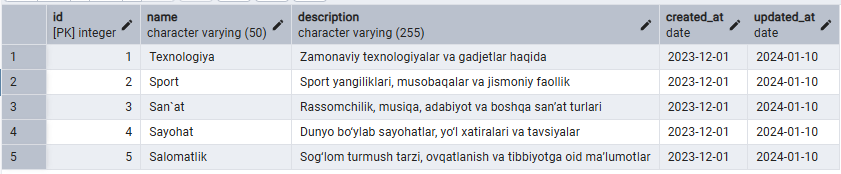
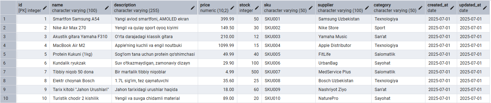
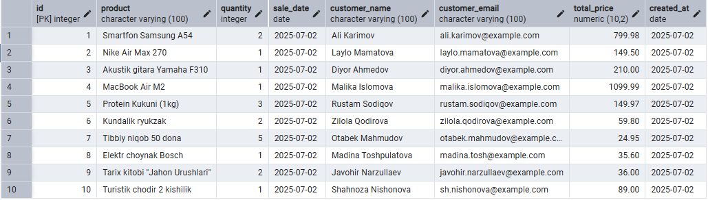
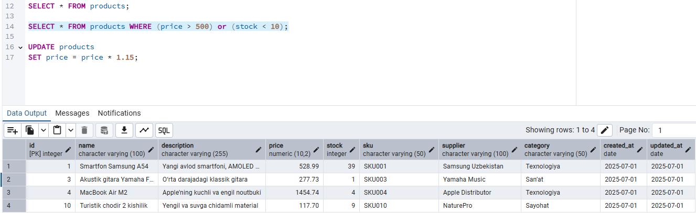
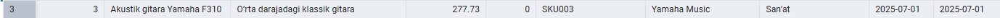
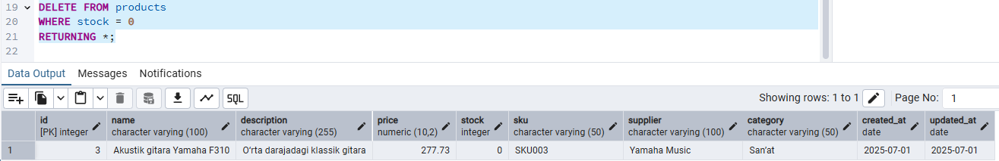
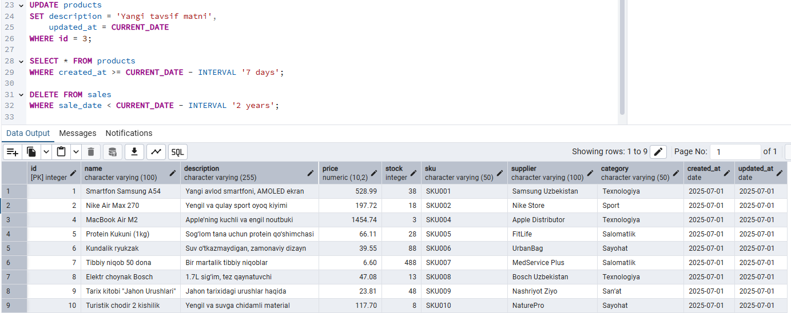

# HomeTaskDay2

PostgreSQL 17.5

# Topics

1. Introduction fot install PostgreSQL
2. Introduction to PostgreSQL
3. Operation with data

# 📦 Store Database Project (PostgreSQL)

Bu loyiha PostgreSQL asosida kichik bir do‘kon (store) ma’lumotlar bazasini yaratish va u bilan amaliy SQL so‘rovlar bajarishni o‘z ichiga oladi.

## 🛠 Strukturasi

### 📁 1. Baza nomi:

`store_db`

### 🗃 2. Jadval tuzilmalari:

#### 📌 categories

| Field       | Type         | Constraints          |
| ----------- | ------------ | -------------------- |
| id          | SERIAL       | PRIMARY KEY          |
| name        | VARCHAR(50)  | UNIQUE, NOT NULL     |
| description | VARCHAR(255) |                      |
| created_at  | DATE         | DEFAULT CURRENT_DATE |
| updated_at  | DATE         | DEFAULT CURRENT_DATE |

#### 📌 products

| Field       | Type          | Constraints          |
| ----------- | ------------- | -------------------- |
| id          | SERIAL        | PRIMARY KEY          |
| name        | VARCHAR(100)  | NOT NULL             |
| description | VARCHAR(255)  |                      |
| price       | NUMERIC(10,2) | CHECK(price > 0)     |
| stock       | INTEGER       |                      |
| sku         | VARCHAR(50)   | UNIQUE               |
| supplier    | VARCHAR(100)  |                      |
| category    | VARCHAR(50)   |                      |
| created_at  | DATE          | DEFAULT CURRENT_DATE |
| updated_at  | DATE          | DEFAULT CURRENT_DATE |

#### 📌 sales

| Field          | Type          | Constraints            |
| -------------- | ------------- | ---------------------- |
| id             | SERIAL        | PRIMARY KEY            |
| product        | VARCHAR(100)  | NOT NULL               |
| quantity       | INTEGER       | CHECK(quantity > 0)    |
| sale_date      | DATE          | DEFAULT CURRENT_DATE   |
| customer_name  | VARCHAR(100)  | NOT NULL               |
| customer_email | VARCHAR(100)  |                        |
| total_price    | NUMERIC(10,2) | CHECK(total_price > 0) |
| created_at     | DATE          | DEFAULT CURRENT_DATE   |

---

## 🔍 Amaliy topshiriqlar

1. **5 ta kategoriya** qo‘shish (`categories`).
2. **10 ta mahsulot** qo‘shish (`products`), `category` ustuniga to‘g‘ridan-to‘g‘ri matn yoziladi.
3. **10 ta savdo** ma’lumotlarini qo‘shish (`sales`).
4. `products` jadvalidan **barcha yozuvlar**ni chiqarish.
5. **Narxi 500 dan yuqori** va **omborda zaxirasi 10 dan kam** bo‘lgan mahsulotlarni topish.
6. **Barcha mahsulotlar narxini 15% ga oshirish**.
7. Omborda **zaxirasi nolga teng** mahsulotlarni o‘chirish.
8. Biror mahsulotning **tavsifini yangilash** va `updated_at` ni joriy sana bilan yangilash.
9. **So‘nggi 7 kunda qo‘shilgan mahsulotlar**ni chiqarish.
10. **2 yildan oldingi** barcha savdo yozuvlarini o‘chirish.

---

## Server ma`lumotlari:

#### 📌 categories va bu 1 - topshiriq:

#### 📌 products va bu 2 - 4 topshiriq:

#### 📌 sales 3 - topshiriq:

#### 📌 5 - 6 topshiriq:

#### 📌 7 - topshiriq:

#### 📌 8, 9, 10 - topshiriq:

