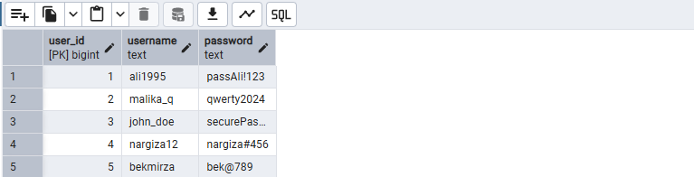
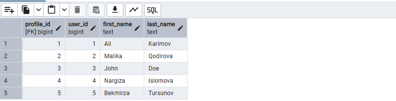
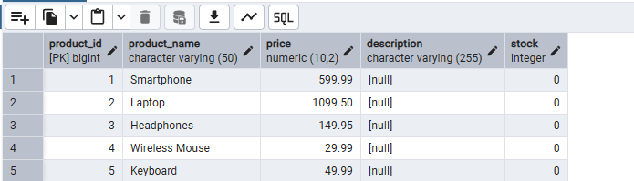
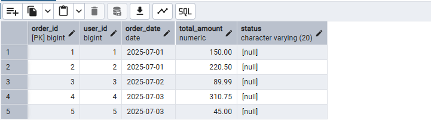
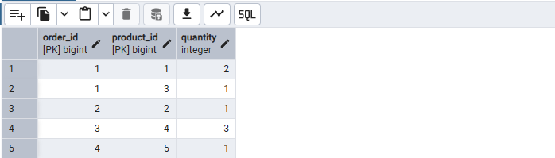

# HomeTaskDay3

# 📦 Shop Database (PostgreSQL 17.5)

## 📋 Maqsad:

Ushbu loyiha doirasida PostgreSQL bazasida **onlayn-do‘kon (shop)** uchun quyidagi imkoniyatlar yaratildi:

- Asosiy jadvallar yaratish (foydalanuvchilar, mahsulotlar, buyurtmalar va boshqalar)
- Bog‘langan ma’lumotlar bilan ishlash
- SELECT so‘rovlari orqali ma’lumotlarni filtrlash
- Jadval va ustunlarga o‘zgartirishlar kiritish (modifikatsiya)

---

## 🗃️ 1. Baza va jadvallar yaratish

### Baza yaratish:

```sql
CREATE DATABASE shop_db;
```

## 📋 Jadvallar:

- users – foydalanuvchilar

- user_profiles – foydalanuvchi profili

- products – mahsulotlar

- orders – buyurtmalar

- order_products – buyurtma va mahsulot bog‘lovchi jadval

- Jadvallarda PRIMARY KEY, FOREIGN KEY, NOT NULL, CHECK, DEFAULT cheklovlari ishlatilgan.

## ✍️ 2. Har bir jadvalga 5 tadan misol ma’lumot kiritildi

### 👤 users:

```
INSERT INTO users (email, password_hash) VALUES
('ali1995', 'passAli!123'),
('malika_q', 'qwerty2024'),
('john_doe', 'securePass1'),
('nargiza12', 'nargiza#456'),
('bekmirza', 'bek@789');
```



### 👨‍💼 user_profiles:

```
INSERT INTO user_profiles (user_id, first_name, last_name, birth_date, gender) VALUES
(1, 'Ali', 'Karimov', '+998901112233'),
(2, 'Malika', 'Qodirova', '+998931234567'),
(3, 'John', 'Doe', NULL),
(4, 'Nargiza', 'Islomova', '+998909998877'),
(5, 'Bekmirza', 'Tursunov', NULL);
```



### 📦 products:

```
INSERT INTO products (product_name, price, stock) VALUES
('Smartphone', 599.99),
('Laptop', 1099.50),
('Headphones', 149.95),
('Wireless Mouse', 29.99),
('Keyboard', 49.99);
```



### 🛍️ orders:

```
INSERT INTO orders (user_id, order_date) VALUES
(1, '2025-07-01', 150.00),
(2, '2025-07-01', 220.50),
(3, '2025-07-02', 89.99),
(4, '2025-07-03', 310.75),
(5, '2025-07-03', 45.00);
```



### 🔗 order_products:

```
INSERT INTO order_products (order_id, product_id, quantity) VALUES
(1, 1, 2),
(1, 3, 1),
(2, 2, 1),
(3, 4, 3),
(4, 5, 1);
```



## 🔍 3. SELECT ... WHERE so‘rovlari (filtrlash):

```
1. SELECT * FROM orders WHERE order_date > '2024-05-01';

2. SELECT * FROM user_profiles WHERE first_name = 'Ali';

3. SELECT * FROM products WHERE price > 50;

4. SELECT * FROM orders WHERE user_id = 1;

5. SELECT * FROM order_products WHERE order_id = 1;
```

## 🧾 4. Jadval strukturasini o‘zgartirish:

### products jadvali:

```
ALTER TABLE products ADD COLUMN description VARCHAR(255);

ALTER TABLE products ALTER COLUMN price TYPE DECIMAL(10,2);

ALTER TABLE products ALTER COLUMN stock SET DEFAULT 0;

```

### orders jadvali:

```
ALTER TABLE orders ADD COLUMN status VARCHAR(20);
```

### user_profiles jadvali:

```
ALTER TABLE user_profiles ALTER COLUMN phone TYPE VARCHAR(20);

ALTER TABLE user_profiles DROP COLUMN phone;
```

### order_products jadvali:

```
ALTER TABLE order_products
ADD CONSTRAINT fk_product FOREIGN KEY (product_id) REFERENCES products(product_id);
```
